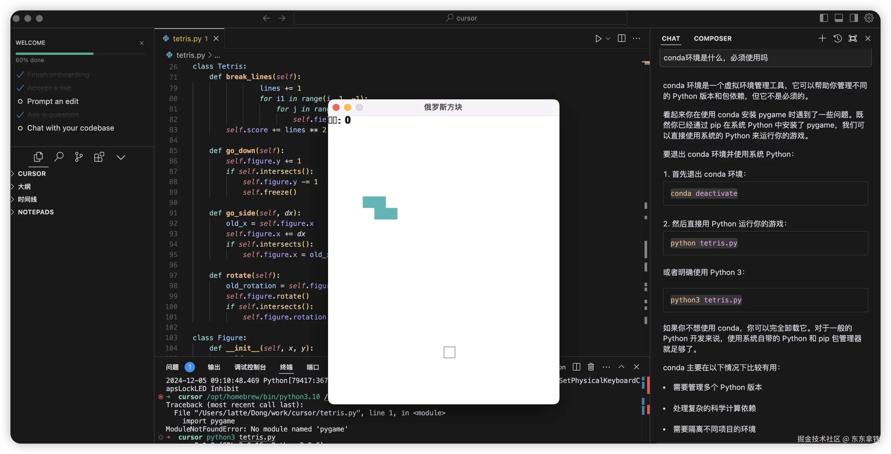
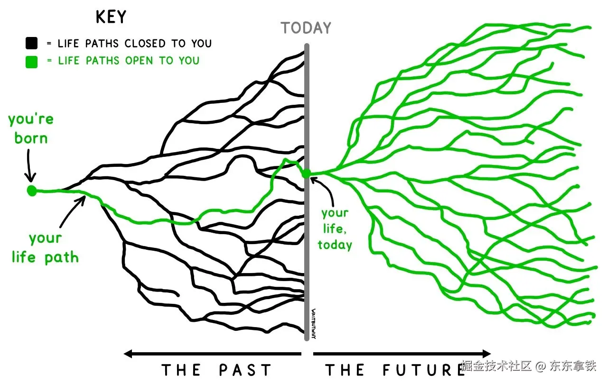

# AI 时代下的程序员：深耕领域，还是迎接技术变革？

## 引言

好多年前韩寒有一部电影《后会无期》，王珞丹饰演的苏米讲过一句话，"听过很多道理，却依然过不好这一生"。你是否也有类似的感受？

上高中时，有一次跑操结束，副校长站在主席台，给全年级同学讲了一个寒号鸟的故事，印象最深刻的是校长声情并茂的讲了一段话：“哆嗦嗦，哆嗦嗦，寒风冻死我，明天就垒窝。”本来校长是想通过这个故事教给大家不要懒惰的人道理，可我记住的只有身边同学忍俊不禁的场景。

上学时老师告诉我们“书山有路勤为径，学海无涯苦作舟”，生活中父母告诉我们要“吃得苦中苦，方为人上人”；工作中领导又告诉我们“世上无难事，只怕有心人”；到了一定年纪，周围的亲戚朋劝我们说“先成家后立业”，哪怕对生活感到不满，身边的人也会劝道：“知足常乐”。

但是无论是什么道理，它有一个共同点，就是给你提出更高的标准。光听所谓的大道理，我们凭什么非得满足外界给我们的“高要求”呢？

## 延迟满足

我发现许多道理其实是想要教会我们一件事情：**延迟满足**。

什么是延迟满足，简单来说就如同棉花糖实验：把一块棉花糖放在孩子面前，并告诉孩子如果你能忍住不吃这一块棉花糖，15 分钟后你就可以吃两块棉花糖！

在成长过程中，我们常常听到这样的劝告：努力学习，等你考上了大学，你想谈恋爱就谈恋爱，想玩游戏就玩游戏，随心所欲的做自己想做的事情！

老师们一直以来也是用这个方式来劝我们，现在努力学习，将来考出好成绩，更远的将来就能得到一个好工作，从而过上幸福的生活。

我们现在吃苦都是为了将来的幸福，要想人前显贵，就得背后受罪，孩子你得忍住啊！

可是现在“棉花糖”的做法已经越来越不好使了。

你现在让我对新一代年轻人说，你少去外面疯、别上网玩游戏、也不要试图去讨好你喜欢的人，你应该一门心思就学习。这样等你 30 岁之后，就可以有房有车、结婚生子了……也不要忘了要努力工作，这样就可以不断提升你的职级，承担更重要的岗位，做更重要的工作。你觉得他们能被打动吗？

现在的年轻人只要看一看现在那些 30 多岁的人，每天为了还房贷车贷那么辛苦地工作，一年只有一点假期，一点都不快乐连婚都不愿意结。工作更别说了，能不能到更高的岗位先不谈，搞不好一到 35 就被裁了 —— 你说这有啥可向往的？那你说的很多道理我就先不听了，我为什么不先快乐几年再迎接生活的毒打呢？

最明显的就是越来越多的年轻人觉得工作本身没啥意义，可又不得不上班。星期一感觉整个世界都是痛苦的，最喜欢的是星期六。在公司每时每刻都盼着下班，假如今天加班多干了一点活，晚上一定要报复性地熬夜玩手机，我要把被剥夺的娱乐找回来……

有一个兴起于上世纪七八十年代的学说叫「自我决定理论（Self-Determination Theory, STD）」，到现在也比较受学者推崇，是对人的驱动力的深刻洞察。其中有一个洞见是，一个人想要形成内驱力，有一个需要满足的心理需求是自主性。

一句话简单概括自主性就是：我做一件事纯粹是我自己的选择，是根据我的意愿、价值观和兴趣决定的，是我自己主导。
可我意识到我们在长大过程中所听所学的道理，都是在被动接受的。你只需要听长辈的话，我们这可都是为你好，你最好别有太多想法。

那我们是否还有必要去弄明白那些被反复强调的道理呢？答案是肯定的。道理和知识为我们揭示了生活的更多可能性，也赋予了我们做出更明智选择的能力。

## 选择的自由

有句话老话说：“吃得苦中苦，方为人上人。”这种观点曾经深深植根在我们心中，只有经历了艰难困苦的磨砺，忍受各种常人难以忍受的艰辛，才能够出人头地，获得超越常人的成就和地位。

可还有一句话是这样的：“识时务者为俊杰。” 这句话又强调要能够认清形势，顺应时代潮流和当下局势，做出明智的决策和选择。

那到底是应该在所在领域深耕，把技能和应用框架学习到极致。还是说应该“识时务者为俊杰”，持续学习最新的技术，甚至尝试着让 AI 代替自己工作呢？

对一个程序员来说，我们都知道技术需要踏下心来学习和研究，成为某一个领域的技术专家是一个很好的发展路线。可面对 AI 的快速发展，我们也可以选择踏准技术变革的浪潮，用新兴的技术找到属于这个时代新的机会。

毕竟这一年 AI 的发展迅速，不但让日常的技术问题可以有更高效率的方式去处理，AI 已经能够辅助我们完成一些编程任务，比如代码自动生成和优化。（比如下图这个俄罗斯方块，我用几十个字的提示词，AI 五分钟就帮我完成了代码编写）

其实类似的选择无处不在，我在网上看到过一张图。

这张图想表达的是，过去你曾经有过很多个选择，但是你已经选定了 —— 但是此刻，你眼前仍然有无数条路，都可以选择。这张图看起来很励志，但随着年纪的增长，我们的选择越来越少。

现在许多工作年限久的程序员，都有着不小的压力，技术更新迭代很快，为了跟上变化不得不一直去学习新的技能和框架。行业风口又一直在变，大数据、区块链到现在的 AI。行业发展放缓，企业不断的降本优化和输出人才，一旦被裁换工作都有着不小的挑战。

尤其是你工作时间在 5 年以上，你在日常工作中你任劳任怨，项目紧急的时候公司要求 996，你毫无怨言。有些没人愿意做的繁琐工作，领导安排给你你也照单全收，然后……你除了会收获一个“老黄牛”的外号，还会得到领导的一句慰问：“这一年，你辛苦了。”

那你说当你年龄越来越大，你在介绍自己的时候还只会说：“我有着丰富的经验，能吃苦，能加班。”还能有多大的分量呢？你会发现你没得选，你必须选择让自己找准趋势。

当然并不是说任劳任怨是错误的选择，但越早的了解到人生的可能，并提前做出选择，总比外界发生变化时，我们束手无策要好。

道理并不是在教我们做事，道理让我们看到了更多的选择。最终，选择权永远掌握在我们自己手中。

## 说在最后

道理并非单纯的行动指南，它更像是让我们理解选择的自由，并通过选择权为自己的生活带来更多可能性。

或许你会想问什么影响了你的选择，我的看法是我们需要认识到做事有目的，人生有意义。
