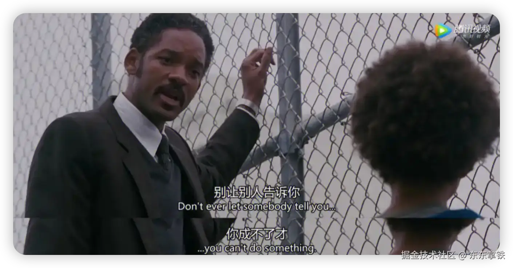

# 不确定时代的选择：成为工具人、玩家还是塑造者？

## 引言

这个世界是有很大的不确定性的，变化总在发生。

你是否曾在某个时刻感到自己正在被时代的洪流所裹挟？曾经的互联网红利驱使着我进入互联网行业，成为一个程序员。

转眼间 AI 趋势就变得不可阻挡，曾经的高速收费员被 ETC 取代，人工客服被智能机器人取代，甚至一些软件开发和测试人员，都在悄然被自动化和 AI 取代。

原先我们害怕成为岗位上的螺丝钉会让我们自己变得机械和僵化，可现在看来螺丝钉的岗位都会变得越来越少。

面对这个充满不确定性的世界，究竟我们该如何定义自己的角色？是安于现状，还是奋力追求改变？

今天我想聊聊面对世界的三种状态：工具人、玩家、塑造者。

## 工具人

规则是什么，是指规定出来供大家共同遵守的制度或章程。

工具人的最大特征是没有主动性，只在规则内做事。

在学校，我们遵守校规校纪；在职场，我们遵循规章制度；哪怕是玩游戏，都得按照攻略去玩。

工具人大部分时间接受的就是这样的教育，努力学习规则，遵守规则。如果因为特殊情况或者情感冲动而违反规则，可能会感到羞愧，认为自己是不是做错了什么。

因为规则的存在，所以在衡量的时候，就有了标准。就像学生时期用标准化的知识教学，每个问题都有标准答案，它要求我们知道什么是对，什么是错。

职场中，以执行命令为使命，你只需要按照流程把事情做好，那你就是好员工。这就是绝大部分公司对于一线员工的要求，所以当代年轻人经常调侃自己是“工具人”。

工具人被告知世界是确定的：只要你好好工作，领导就会看到你的付出，年底还会给你奖励。

所以我们逐渐习惯了面对考核，考大学，考研，最后考公务员或者进入企业，但考核没有结束，月度考核，半年考核，年中绩效。

参加考核时心里七上八下，等待考核结果时又惴惴不安。

不得不说我自己在绝大部分时候也是一个工具人，尤其是在职场中，面对规则，接受规则，然后被考核。迎合外界标准，把一切都做对。

就像在山东，公务员、老师、医生就是一个被大家认为正确的事情，再不济你也得去国企，你可以工资低，但是你得稳定，你工资高不重要，过年过节发的鲁花 5s 压榨花生油才是真面子。

尤其是在当下经济增速放慢、企业大规模裁员的情况下，尽管这些工作让他们感到安稳，薪水稳定，但却很少有机会改变现状。

这种状态有一个最大的特点就是，放弃了自己的个性，选择去追求确定性。

但世界是不确定的，明明按照标准要求自己，做好了手头上的事情，遵守规则努力把一切都做对，结果很有可能就是失去了个性，也没有得到确定性。

## 玩家

如果能认识到这个世界的不确定性，那我们就有可能成为一个玩家。

玩家并不违反规则，而是知道在规则的缝隙中存在着广阔的发挥空间。

玩家很重要的一个特点是主动性，不是别人告诉你你要去做什么，而是你想做什么。评判标准不是外界给的，而是自己定的。

记得 2022 年，宝宝出生的前半个月，恰逢赶上了假期政策调整，陪产假从 7 天改为 14 天。

这的确是个好消息，我能多休一周的时间，但是坏消息公司的 OA 系统迟迟没有更新，申请时还是固定显示七天，我刚入职没多久，不知道怎么去协调这件事。

我一直以来都是很遵守公司政策的，毕竟公司和公司间有很大差距，就像即使是在北京，也照样有公司不足额缴纳五险一金一样，你只能被动接受。我先去找了领导，领导回复我说：这个得看公司政策，以系统为准。可系统没有变，怎么办。

可出于对刚出生的宝宝不放心，我又去找了 HR 协调，HR 又找了他的领导确认政策，最终和我领导打了招呼，我在系统上提交了两个陪产假申请，顺利的休息了两周。

连着提交两个申请的时候，连我的直属领导都很诧异，没想到这种假期还能这样申请。

我发现在规则下，通过争取可以得到更好的结果。

玩家不需要别人告诉他什么是对什么是错，而是去试错，自主摸索世界的边界。

就像《当幸福来敲门》里面威尔史密斯给他儿子说的那句话：Don't ever let somebody tell you,you can't do something.

小朋友们做的就比大人好，就像刚学会吃饭的小朋友，看到食物摆到面前就会迫不及待的用手去抓，你怎么拦着他都没有用，但如果小手感觉到烫之后，下次再抓之前就会用嘴吹吹。

小时候我们从来不会面对一件新鲜事物就说自己做不到，似乎只有身边人的人会告诉我们：你不适合做这件事。我们与生俱来的能力，只不过随着长大，我们自己把自己限制住了。

一名合格玩家想要掌控自己的命运，需要有批判性思维，你得自己去评估信息，提出质疑，寻找证据，小心求证，才能合理判断什么是真，什么是假。

批判性思维在这个时代越来越重要，因为当下获取信息太容易了，真相会传播，谎言也会传播，优质的知识会传播，低劣的知识也会传播。

我们得在庞大的信息当中，抽丝剥茧出那些对我们有用的东西。

## 塑造者

我们对世界的解释永远都是主观的，认识到这一点，就有机会成为一个塑造者。

塑造者，制定规则，改变世界。

1997 年，在乔布斯重新回归苹果之后，他们这一年推出了一只广告，主题叫“非同凡想”“Think Different”。那段广告词后来成为了经典，我觉着用这段广告词来形容塑造者再适合不过了。

向疯狂人士致敬。

他们特立独行。他们桀骜不驯。他们惹是生非。他们方枘圆凿。他们眼光独到。他们讨厌条条框框。他们不屑安于现状。

你可以把他们的话语引作经典，也可以反对他们的观点，你可以颂扬他们，也可以贬损他们，但唯独不能忽视他们。

因为他们带来了改变。他们推动了人类不断向前。他们或许是别人眼里的疯子，但却是我们心中的天才。

只有疯狂到认为自己可以改变世界的人，才能真正改变世界。

说起乔帮主，是在是有太多故事可以讲，他的一生可以说是硅谷创业神话的代表。他从自己家的车库起家，打造出全球最有价值的公司之一。他推出的产品一次次颠覆世界，比如 Apple II，Mac，iPad，iPhone。

既然我们对世界的解释是主观的，那么我们就可以通过施加影响力，改变别人的内心的想法，很多书中把这个能力叫做“现实扭曲力场”。

“关于现实扭曲力场”最有名的故事是在 1983 年，乔布斯想挖百事可乐的 CEO 约翰·史考力来苹果。要知道，当时的苹果，只是一家刚刚崭露头角的小公司，而百事可乐是全球饮料业巨头，这就好像是蚂蚁和大象在对话。但是，乔布斯只用一句话就把局面扭转过来了。他对史考力说：“你是想卖一辈子糖水，还是想跟我一起改变这个世界？”

那一年乔布斯过的并不如意，他在已经受到董事会的非议与压力，IBM 的销量反超苹果，当时力推的 Lisa 电脑昂贵且占用了内部大量经费，董事会已经在考虑换掉他，可就在这种情况下，他依然通过改变世界说服了史考力加入苹果公司。

不过很明显，塑造者是没办法培养的，可能需要极大的天赋，以至于他们能够理解复杂的事物，理解这个社会很多事情会事与愿违，很多大型组织本质上是个草台班子。

但是当世界遇到某种问题正在变坏时，他们会勇敢的站出来去解决问题，他们有主人翁精神。

你是否曾经怀疑过现有的规则和秩序，想要去挑战它们？只有那些敢于突破界限的人，才能真正推动社会前进。

## 说在最后

赫尔曼黑塞在著作《在轮下》的一句话 “面对呼啸而至的时代车轮，我们必须加速奔跑。有时会力不从心，有时会浮躁焦虑，但必须适应。因为它可以轻易地将每一个落伍的个体远远抛下，碾做尘土，且不偿命。”

总的来说，世界不会为任何人停留。我们无法预测未来将如何变化，但我们可以选择如何面对这些变化。是随波逐流，还是主动掌舵，决定了我们能走得多远。
