# 致低谷期/正失意的你：一个 90 后的自我救赎经历

## 前言

可爱的掘友们，好久不见，见字如面。

再过 19 天就到 2025 年了，2024 年，你过得还好吗？

今天这篇文章，只有低谷期的自我救赎和感悟，希望对你们有些帮助。

## 做只关机的电子蝴蝶

7 个月前，我处在身体病变+情绪心理的双重夹击下，状态日渐消极，我意识到这样下去会越陷越深，必须要做出改变才行。

5 月份起，我关闭了朋友圈，开始减少对三两知心好友的联系，并停用了现有的社交账号（事实上，这几年早就停用了）。除了工作原因，日常我很少在社交媒体上发表动态和评论，因为比起网络洪流，我更注重生活本身。

即便如此，我还是处在一个浩如烟海的失衡环境中，身边人也处在信息茧房里，被网络各种声音支配着，进而对我产生了一些影响，让我静不下心来，我想屏蔽掉这一切，哪怕是做只一关机就谁都找不到的电子蝴蝶。

于是我停更了社交账号，回归到生活。我开始拿着平板看电影，看文综，看学习类和搞笑类的东西；偶尔会玩些益智的小游戏放空下大脑；会陪着家人带着狗狗去看海，给他们拍照片和剪辑视频；会下厨研究做柠檬鸡爪、奶茶、三明治等；有时也会一天都拿着数独本解数独···

无人问津的日子里，我的独处能力再次增强。直到今天，我的朋友圈依旧是关闭状态，我已经习惯了这样的日子，我不知道朋友圈每天都在发生着怎样的故事，我只知道，过好自己的生活，才是美好生活。

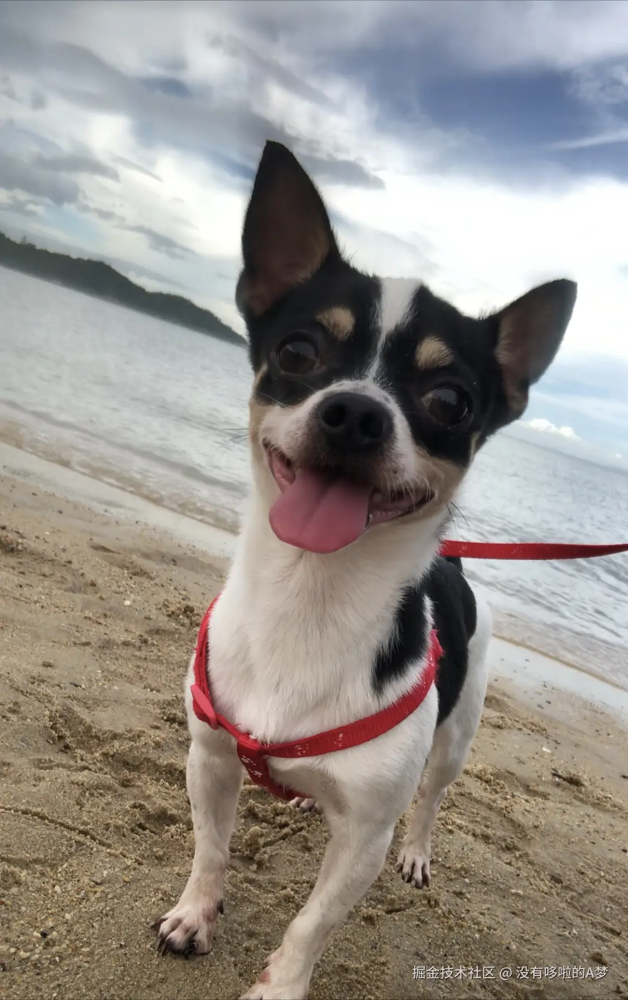

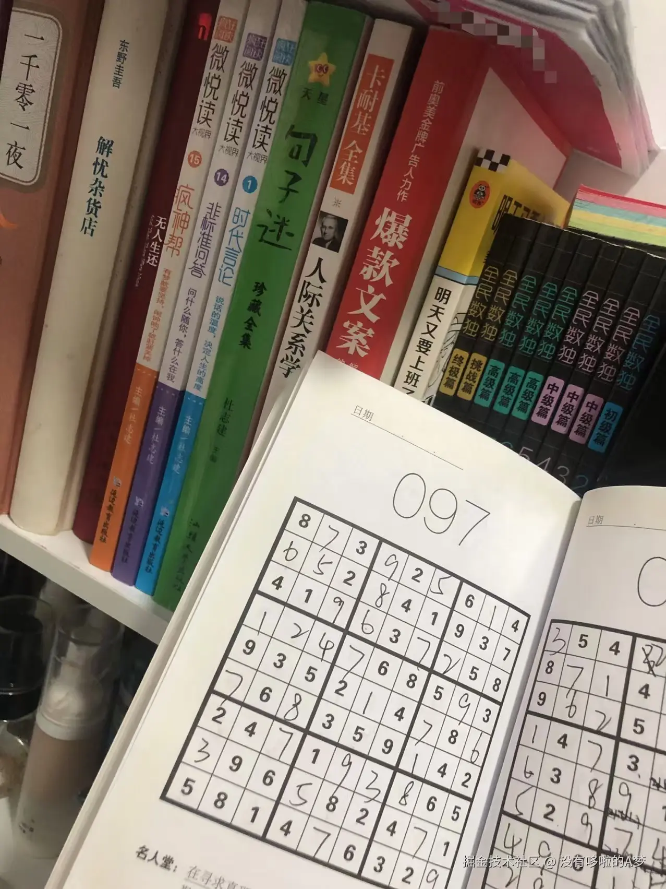

## 做个专注的阅读者

在关闭朋友圈和停用社交账号后，我的时间更多的聚焦到了自己身上。

在我读书时代+工作的前 5 年里，我一直都有购买纸质书籍阅读的习惯，后来因为网络电子化的普及+工作量和压力的骤增，购买纸质书籍阅读的频率愈来愈低，我的习惯开始变成了每晚睡前看时评文章/新闻，更多时间只能在网上“快餐式”阅读。

直到朋友给我寄了 2 本书过来，我才重新阅读起来，在此期间，我也在当当网上下单了将近 10 本书，这些书籍涵盖了杂谈类、心理类、休闲类等，每天除了三餐规律，我大部分时间都用来阅读。

我优先阅读了《天才在左·疯子在右》这本书，因为这是一本心理学类的书籍，是对一个特定群体的访谈记录集，所以我花了 3 天就把它看完了。

这本书里面有不少角度或观点都很有深度，对于世界观的认知会带来一定程度上的延伸思考，后面我又二刷了一次，有机会我会单开一条沸点或一篇文章和大家分享下。

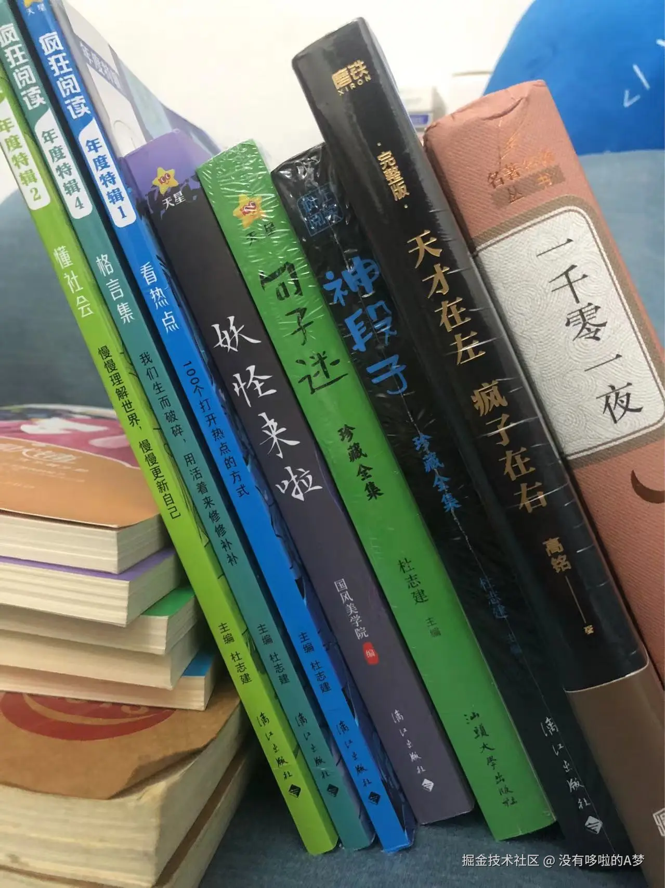

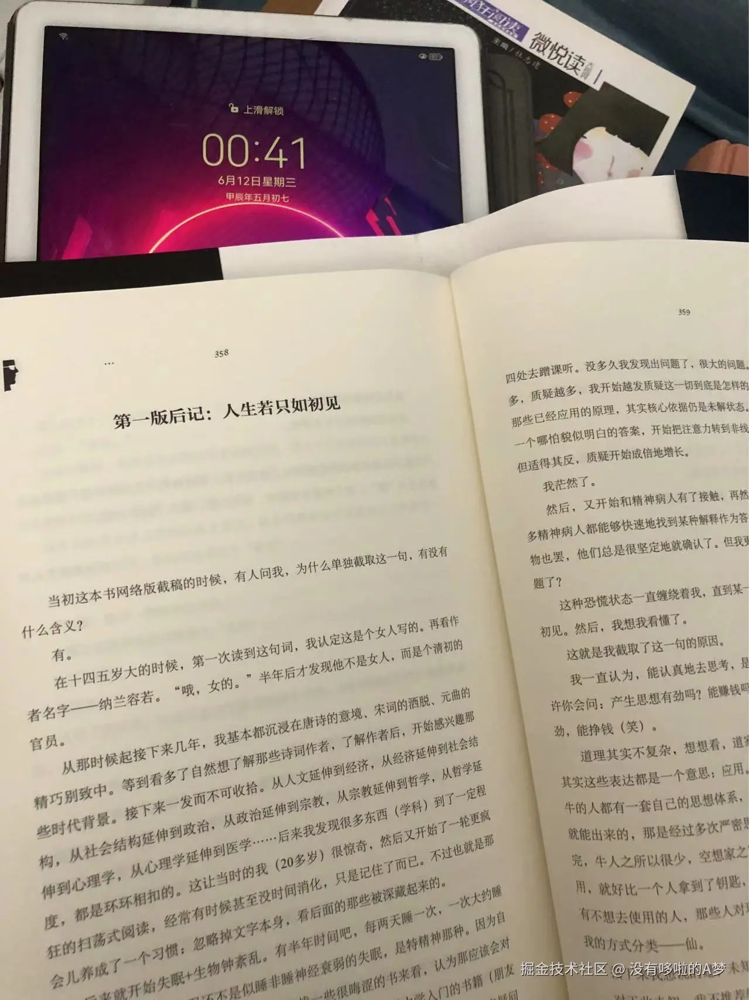

## 给生活加点色彩吧

在阅读之余的某一天，我看到妈妈在午休时，经常会不小心把手机掉在地板上，于是我临时下单了个移动床头置物架。

为了能更高效利用家里的一部分空间，也想给家里和生活增加点色彩，我还下单了书架+花架+置物架+绿植花苗菜种子。

那段时间，我每天都在家里组装着各种架子，拿着工具照着说明书吭哧吭哧的捣鼓着，随着一个个架子的成型，心里还是有点小成就感的。

安装完架子后，我开始忙着填土种菜种花养绿植，经过我的精心照料下，花盆渐渐变成了光盆，最后不仅“喜提”妈妈好几天的吐槽，也变成了妈妈的种植角。

后来经过种植大神的分析，确定不是我的问题，是因为持续的高温天气+花架又放在阳台那+网购的基本上是用药水药出的的“星期花”，所以最终基本上空盆了。

失败是成功之母，只有我是成功支付，我达成了另一种层面的前人栽树（我成功支付），后人乘凉（爸妈喜提种植体验）。

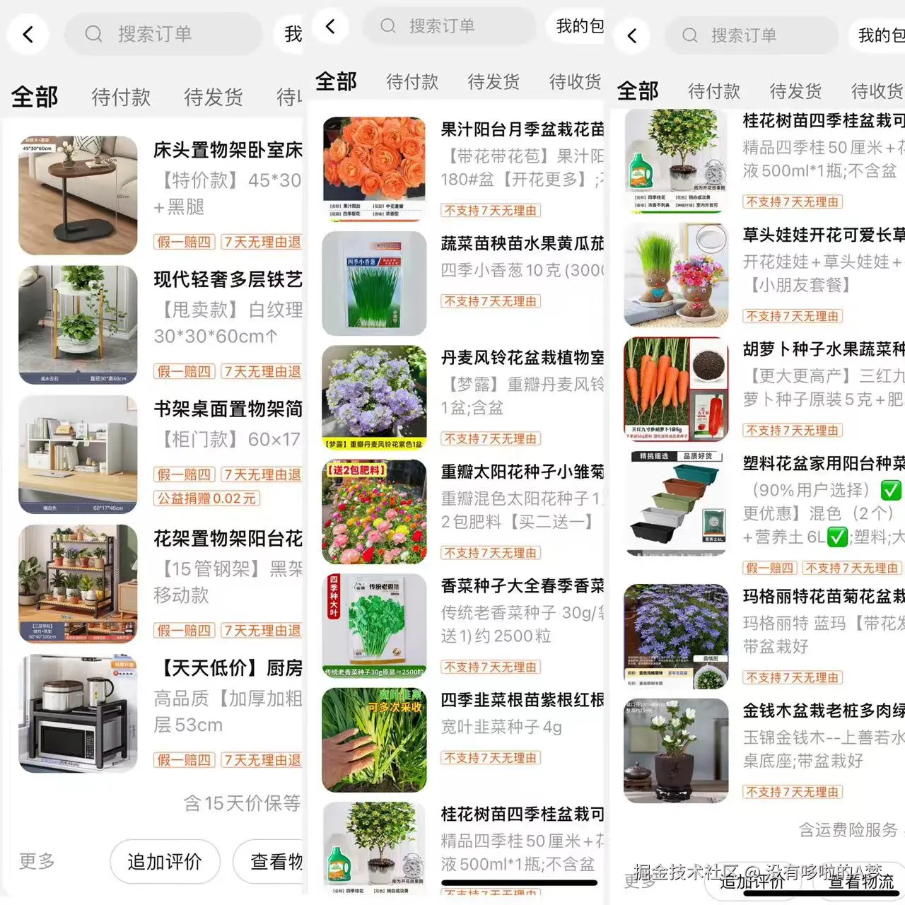

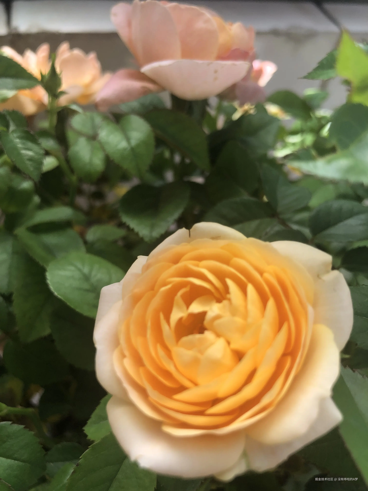

## 认真学个技能吧

种植体验解锁失败后，我去学车了。在学车期间，也发生了一些故事，比如：

1、刚到训练场还没 10 分钟，就被教练叫我回家，因为教练忙着教其他学员，便让资深学员来教我，但资深学员自己要练车，没多大耐心教我，就直接和教练说教不会我，为此我坐公交回家时还特别委屈，一直在偷偷擦眼泪，我愿意学结果却放弃我。

2、连续 3 天口腔和鼻腔出血，家人吓到了，我也懵了，因为从来没出现过这样的情况，后来才发现是练车导致的，因为每次练车，教练都不给我开空调，还把开了的空调给关了，要么就调到暖风模式，让我热到受不了。

3、教练说带我上公路体验下，后面发现是去医院接教练的岳父，因为他岳父骑电动车掉沟里去了。

4、考科三前，我问教练靠边停车 30 公分有什么技巧或点位，教练说靠感觉，结果“靠感觉”让我两把都挂在靠边停车上，不得不重新预约了最少一个月，才成功约到科三再次考试。

虽然教练为了省油费给我添了一些堵，但从始至终，我没花钱去模拟，该学的我认真学，该做笔记的做笔记，该画路线的画路线，此外还自己找了不少考场模拟视频反复看，直至做好准备后，自己去考场考试，考完再自己回来。

在这次学车过程中，我遇到了训练场的另一个巧克力小老头教练，他会开好空调让我去空调房坐着等我的教练；会帮我把教练车开出来并给我打开空调；会在我倒库倒不好时过来指点下我。有时候温暖的善意就是这么让人感动，后来我特意买了水果送给他，并当面感谢了他的照顾，小老头教练怪不好意思的收下了我的谢意，我猜他那天心情肯定也很好。

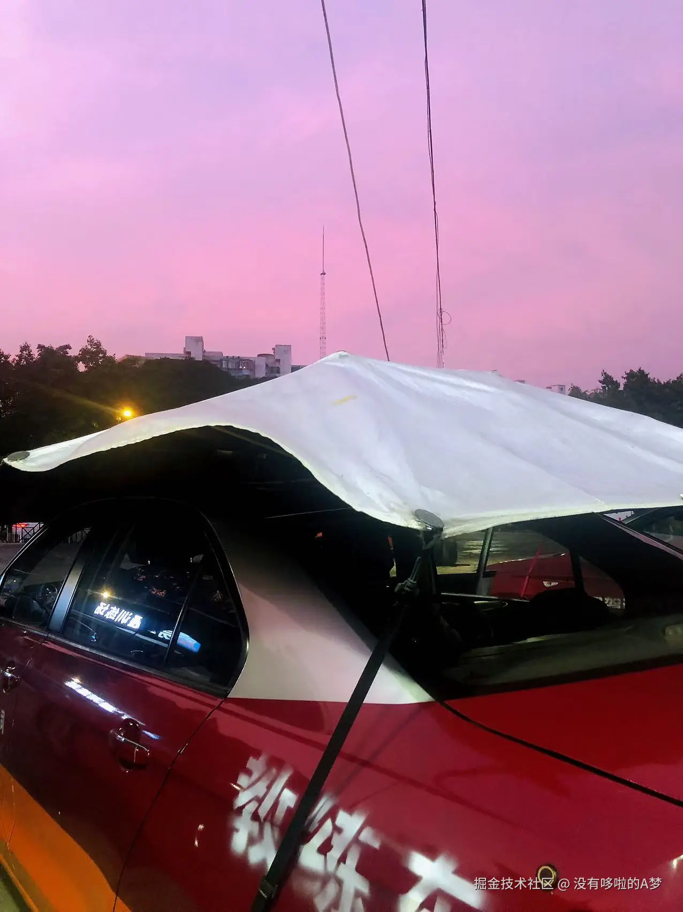

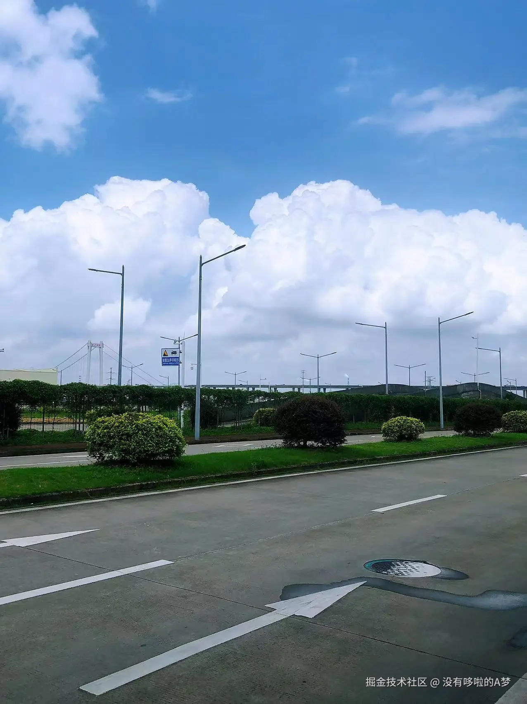

## 做还没做完的事吧

在一边忙着学车的同时，我也一边忙着做以前还没做完的事，或者是找一些事来做。

比如，把一年多还没开始画的个人数字油画给画完；把几年前网购还没拼的积木给拼完；下单了几个魔方，研究怎么把它完整还原；打卡多邻国，重温下英语或新学下其他语言；期间顺道完成了自己的学历毕业实践报告···

在这大半年的时间里，我淡出网络，停更账号，回归生活，专注自己，有时会一天都在阅读；有时会一天都在画画；有时会一天都在拼积木；有时会一天都在刷题；有时一天都在研究魔方；有时也会一天什么也没做，就听歌放空···

我跳出日常生活秩序，不立 flag 不设目标，每天顺其自然，或者是“荒废度日”，在有些人的评判标准里，我做的这些，有些事没有意义，有些事浪费时间，有些事产生不了收益。

可对于低谷期的人来说，最没用的就是评判标准，只要能让自身恢复能量、心态变好、情绪平和，即便浪费些时间去做别人眼里无意义的事，也是一种意义。

就像我一个人去旅行，我知道旅行并不能实际解决生活中的任何难题，但“在路上”本身就充满了力量，让我建立新的期待，持续获得能量，能多与外界发生实在的关系，而不是盲目困在自己的小世界里。

以前总是没机会没时间做的事，趁此时间终于可以一件件，专注且安静的去完成它，并从中得到一个又一个惊喜结果，解锁一项又一项技能。

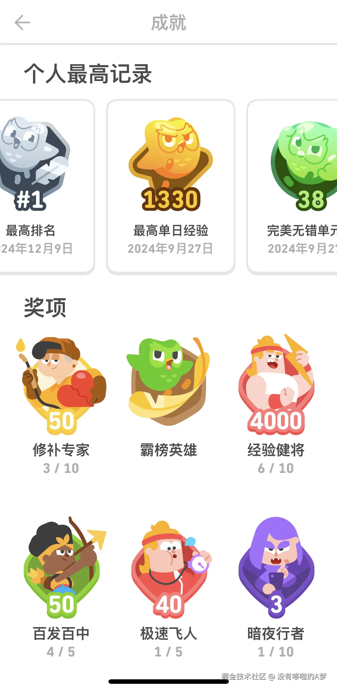

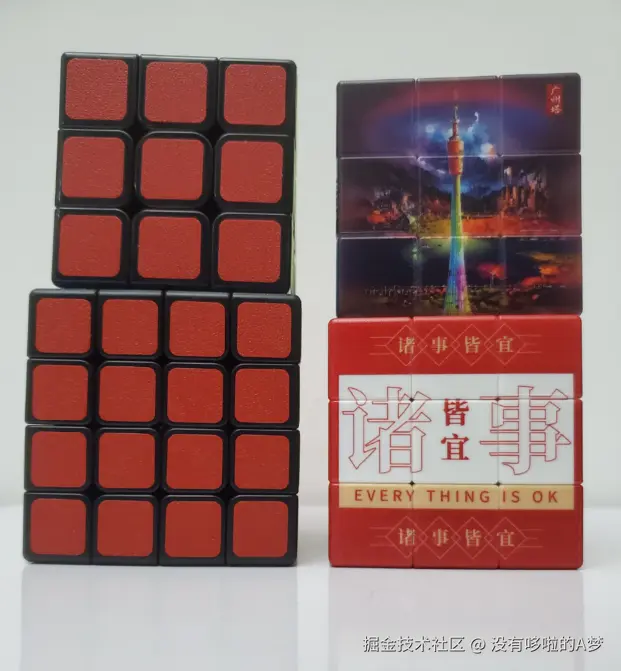

## 这大半年我得到了什么

淡出网络大半年，我做了以上提到的动作，最终得到了：

1、多出了很多陪伴家人和狗狗的时间，关注并满足他们的需求

2、重拾了阅读习惯，强化了思考能力，让大脑保持充电状态

3、动手安装家具，提高空间利用率，方便妈妈打扫卫生

4、爸妈时不时会买些花花草草回家悉心照料，开始感受自然的美好

5、用 3 天时间解锁了魔方的还原技能

6、相继完成了个人数字油画和积木的最终拼装

7、用 5 天时间完成了毕业实践报告，坐等 1 月份拿毕业证

8、在年底前解锁了驾驶证，成为了一个合格的新手司机

如果你们细心的话，会发现我做的基本上都是保持专注力+增强记忆力+让情绪平和的事情，其实此前的我本身耐心还可以，也是个比较开朗的人，但因为一些打击，身体出了点问题，心态情绪方面也受到了影响，所以整个人压抑了很多，但经过这大半年自我的调整，状态在逐渐好转，整个人平和了不少。

如果你正在低谷期，建议顺其自然，学会断舍离（断掉三千烦恼/扔掉废旧之物/离开无效社交），集中精力做你想做的事，在沉淀中为自己打气，多看看自身可爱又优秀的地方，持续保持学习力，逐渐走出低谷，进而向上生长。

如果你是病理性抑郁者，除了配合医生完善心理、药物和物理治疗，最重要的是学会爱自己，不要让自身沉溺情绪中，多接触积极阳光的人事物，多晒太阳多户外运动，可以养条治愈的宠物，慢慢找回热爱生活的信心，不过养了就要负责到底，不要将它随意遗弃。

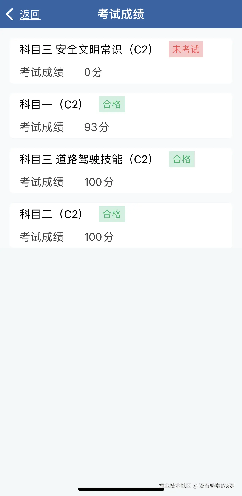

## 附：分享一部分个人真实经历

分享下一部分个人的真实经历吧，这些经历或多或少成为了我变得压抑的诱因，希望我的经历能让你们从中受到一点启发。

### 被偷走的梦想

我出生并成长于广东一个四线城市的农村家庭，小时候家里穷，我又喜欢看书，所以我经常会向同学借书看，我不挑书，只要同学有，我都会借来看，有时看到实用型的知识点，我也会手抄下来，最后作为自己的“百科全书”。

我小学就已经写稿并投到市里的学生报上，还获得了一笔稿费，被全校点名表扬。所以从小到大，我的语文成绩总能名列前茅，那时我的梦想就是做语文老师，因为是真的喜欢。

初三我分到了快班，中考前填报志愿时，我填的是“五年制专科高等学校定向志愿”的语文学科，因为它不用交学费，毕业后还会包分配，那年这个定向志愿师范学院在我们市的录取控制分数线是 610 分。

后来我中考分数超过了这个录取分，被录取了，我们市教育局有个工作人员打电话给我妈妈，通知我去体检并到教育局签合同，一切进行的很顺利，那个暑假我们都很开心。

直到开学，和我同时报考定向志愿的同学都开始入学了，我却迟迟没收到入学通知，他们也问我怎么没来学校上课。后来我妈带着我去教育局找那个工作人员，对方却躲起来不见我们，我们就这样在教育局门口站了一个下午；我妈又去找我的中学校长，但对方以我已中学毕业，管不了为由打发了我们。

高中开学季大家都忙着入学，我差点无书可读，因为我当时只报了那个定向志愿，要么就去读技校，可我不想去，爸妈也为了补偿我，拿出仅有的积蓄，再和亲戚借了点，凑出 5500 元的择校费，最终把我送到了市里排名第四的高中入读。

在那个时候，家人能力有限，网络也不普及，找不到渠道维权，即使有，我们也不知道，所以只能自认倒霉。那是我第一次亲身体会到了“教育不公”，读书并不能改变命运，那时我再也没想要当一名老师。

再后来我们才知道当年填报了定向志愿并被录取的那批考生，不止我一人被人顶替入学了，也涉及到其他考生，只不过其他考生的家长直接到广州教育局去维权，我们市教育局的工作人员为了息事宁人，提出了给考生家长经济的补偿，但考生家长坚持要求要入学，所以最终给考生安排了入学。

有钱、有权真的可以为所欲为，可以买到我努力实现的梦想，而我不仅失去了梦想，被迫走上了另一种人生，我爸妈还得花钱“买”高中入学的名额给我，真是讽刺。

### 放弃大学机会

高一期末考后，我们开始文理分科，学校按照成绩排名在全级进行分班，我选择了文科，并被分到了快班。我在快班待了 3 天还是 5 天，就申请转楼下的普通班，申请转班前我告知过爸妈并说了理由，爸妈没反对，说尊重我的决定。

我至今都忘不了在快班的画面，压抑逼仄的氛围，大家脸上的眉毛就没舒展过，每天像人机一样，机械性学习，拼命的内卷，就连课间时间，去洗手间都是快去快回，疲惫的眼里好像看到了明天，又好像看不到明天。

在普通班的日子，虽没有压力，但还是会认真学习，不过普通班有的老师讲课确实是应付式，照着书念就完事了，有时因为同学课上一直讲话，老师干脆课也不讲就直接回办公室，班主任随后就会来教育我们，但大部分时候，遇到不喜欢的老师，一半的同学课上都在睡觉。

虽然身在普通班，但成绩一直稳坐前三，每次学校举行的全级语文竞赛，我的得分和排名都能拿到全级前三；全级的英语竞赛，我们班有个男生每次都能拿到全级前三，班主任嘴都笑裂了。

后面上高三，我被分到了普通班，继续按部就班学习，成绩依旧名列前茅，只要是全级语文竞赛，都能单刷快班的人，虽然我放弃了快班，但我收获了好的心态和状态，直到高考完。

高考出成绩后，学校通知我们返校填报志愿，我那时在打暑假工，刚好下夜班，就直接去学校，花了 5 分钟填报完了，我选了计算机和商务英语，那时计算机专业的就业前景很好，毕业后就能拿到高薪。（时间是个回旋镖，后来我通过自学，阴差阳错考到了计算机系的专业职称）

没过多久我被广州的大学录取了，但学费太贵，要上万，爸妈倒没有阻止我继续读书，只是说如果真的要读，那就省吃俭用点，努力点工作，给我凑学费，考虑到家里的经济都是爸爸一个人承担，加上我的学费，负担就更重了，所以最终我放弃了读大学的机会，选择进入社会工作，分担家里的经济压力。
两个多月的暑假工生涯结束后，我领到了近 3000 的工资，一大半给妈妈，剩的就拿去报了个电脑培训班，学五笔+各种办公技能，直至学成和拿到证书。之前在学校虽然有电脑课，但一周才有一节，有时甚至不上改自习，电脑课也不教什么，大家每次要么用千千静听听歌，要么上 QQ，要么玩蜘蛛牌游戏。
直到今天，我依然不后悔当初做的这个决定，虽然因为学历问题，我基本上进不到好的大公司，甚至会因为这个问题而被压价，但多年的工作经历让我积累了不少行业经验，赚到了认知和阅历，也最终凭着自己的能力得到了预期薪资，最高时能拿到 11K 的固定月薪（虽然被压了 1K）。

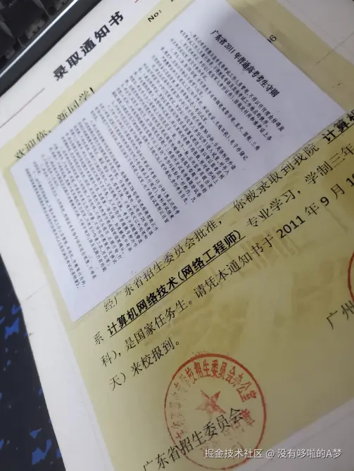

### 人算不如天算

在工作了好几年后，遇到了我前任，他当时主动追我，在稳定谈了一年多后，便在广州买了房，我也和我爸妈一样，在广州有个家了。虽然前任说不需要我月供，让我的钱自己存着，话虽如此，但还是一起还贷，大头部分前任承担，有时他不够钱或者提前还房贷，就我来承担。

前任的薪资比我要高一些，但我净存率还可以，本身我自己也不是什么花钱大手大脚的人，消费欲望不算很高，且吃住在家里，不需要付房租，所以花钱的地方很少，工资的 ⅔ 都能存着，时间久了，也能存到不少钱，除了定期给家用，大部分我都拿去还房贷了。

刚买房的前 5 年是压力最大的时候，前任也是肉眼可见的暴瘦，那时为了减轻前任的经济负担，我们便让他住到家里来，也算相互有个照顾了（爸妈先贷款买房，次年我和前任贷款买房），住了差不多 4 年吧，直至他搬到房子那边住，期间前任还失业了快半年，我们从上万的月供一起努力，供到最后变成了不到 3 千的月供。

那时一切看着未来可期，我也计划入户广州，于是一边忙着工作和出差，一边自学系统集成项目管理工程师的知识，报培训班的费用太贵了，我觉得没必要，完全可以自学，虽然跨行跨领域，大不了一次考不过就考两次，所以只要有时间，我就抱着教材啃，看视频学习，直至学完报考和考过，然后自己找入户教程，自己备好需要的资料，自己完成入户操作，紧接着顺利入户，成为新广州人。

工作方面，因为表现不错，多次获上司和董事长称赞，我便提了加薪申请，但没通过，我意识到他们只是单纯画饼，那时起我改变了工作心态，在完成本职工作的前提下，每天带薪自学 PS 技能，有时也会请教设计同事，直至学成，虽然我的 PS 技能不如专业设计师，但应付日常简单的 P 图需求没什么问题。

后面因为一些原因（双方并没有发生原则性的过错/不存在彩礼问题），前任要分手，别问，问就是对我没爱了，6 年的感情就这样画上了句号。分了后，那段时间坐在电脑面前办公会突然掉眼泪，即便如此，还是赶快擦掉眼泪完成手上的工作，或者到洗手间平复下心情，再回来继续工作。

分手后，前任要我算出 6 年来我在房子上投入的金额，打算后面补偿回给我，后来算出我个人在房子上支出了近 17 万，我爸妈借了 8 万，一共 25 万，亏损率双方按比例承担；后面前任觉得压力大，职场年龄的危机+对未来的迷茫，不想再背贷了（包括要还我的部分），便提出净身出户，我和家人没同意，毕竟对他和他家人不公平；至此房子问题暂时搁置。
再后来发生了一些事，让我和公司产生了一些不愉快，公司以战略调整岗位合并为由给了我 N+1 赔偿（此部分内容可以看我另一篇文章），2 个月内，我先失恋，随之失业，一年后，我身体病变。

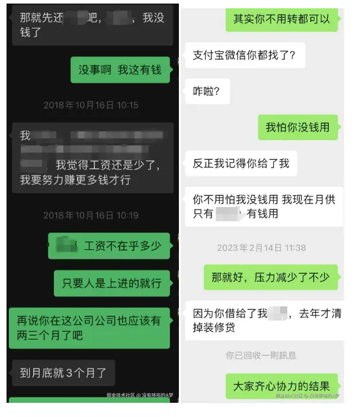

## 复盘、总结和建议

当年偷走我梦想的人可能早就退休了，这件事也促使我定下了另一个目标——离开老家，努力定居到教育更公平、资源更丰富的广州，后来我也实现了这个目标。虽然老家的那批人曾经背刺过我，但错的只是当年的那批人，还是欢迎和推荐你们到我老家游玩；而且现在网络发展迅速，办公效率提升，也更透明化，应该不会再出现像我一样“教育不公”的现象了，不管怎样，现有的考试选拔机制还是比较公平的，尤其是对于贫困学生而言，所以不要因为我的个人经历而丧失了对教育的信心。

放弃大学入读机会，虽然失去了读大学的体验，但同时也解锁了比应届生多几年的工作经验，该吃的亏走的弯路都提前吃完了，后面就不会走得太辛苦。学历后期可以修，虽然学历证含金量不如全日制的高，最起码对公司的选择性变多了，且自带的工作经验比应届生更具有竞争力。但我并不提倡“学历/读书无用论”，如非特殊原因，还是要读大学，受过教育和没受教育的认知和眼界是不一样的，随着时代的变化，市场对学历的要求只会越来越高，除了技能型工厂和初创、中小型企业，90%以上企业的敲门砖首先是学历，所以任何时候，都要保持学习力，不管在职、在校还是待业。

感情虽然画上了句号，但最起码做到了问心无愧。在交往前就和前任明确过会定居广州，前任是同意的，虽然一起买房了，但后期前任也曾对我控诉过：要不是为了你，我不会选择在广州买房；要不是为了你，我不会住在你爸妈家；要不是为了买房，我早就买到了亚洲龙···虽然这些话在当时对我造成了一定的影响，让我怀疑自己，但后来我也想明白了，不要以自己的角度为对方好，只要那不是对方想要的，不仅无意义，还会吃力不讨好，还是放过对方，放过自己吧，对的人应该站在你的前途里，爱要双向奔赴才有意义。这 6 年里，也辛苦他了，不容易，只是我终究能力有限，不能治愈小时候那个渴望温暖和被爱的他，就像他成长那个地方的十八弯山路，把他困在原地，曲折且到不了头。

我写了这么多，和你们分享我的经历，只是想跟你们说，不管此时的你是什么状态，都不影响你向阳而生，向上生长，成为更好的人，人生在世，哪能事事如意，生而为人，我们能做的只能是提升自身的状态和心理阈值，去适应环境和时代，不要轻易放弃，很多事都有解决的方法，如果没有，那就放过自己。

对于焦虑和抑郁的人，奉劝你们不要过于相信网络上的东西，尤其是贩卖原生家庭创伤和消费个人伤痛的博主，他们只会提出问题，不提出解决方案，一直强调、放大痛苦，不断的对你进行心理暗示，从而弱化积极阳光的心理状态，让敏感的人疯狂共情。任何时候，你都要有独立思考的能力和认知，要有自己的判断，实现自我教育、自我成长、自我完善才是强化自身内核最有用的解决方案。

就像我过去的经历，已经是既定事实了，自己做的选择自己负责，虽然一路走来比较辛苦，也因为没钱而放弃选择，但不妨碍后期通过自己的努力去改变这烂泥一样的人生。如果注定天崩开局，那就尽人事听天命，要么逆风翻盘，要么破釜沉舟，怎样都不亏。

感谢贵人，在我困境时拉了我一把；感谢书籍，让我保持独立的思考；感谢爸妈，成长路上对我的支持；感谢掘友，你们的幽默评论和沸点淡化了我的消极情绪；感谢朋友，任何时候都在的陪伴；不感谢过往的经历，感谢正向的自己。在我的精神世界里，我永远理想主义，并以务实心态活在当下。

## 写在最后

2024 年，开心的事，在年终总结；不开心的，在年终了结。

祝所有男孩：承乾坤之正气，立天地之威仪；自是成竹于胸，所行风雨无惧；前程似锦，平步青云，步步高升，鱼化为龙。

祝所有女孩：承天地之灵气，立山水之刚柔；自是天资聪颖，所行花团锦簇；春风得意，满腹经纶，星光熠熠，其华灼灼。

祝我把世俗的目光，一裁再裁，祝我鼎沸有留白，祝我在人生海海，尽兴，开怀。
