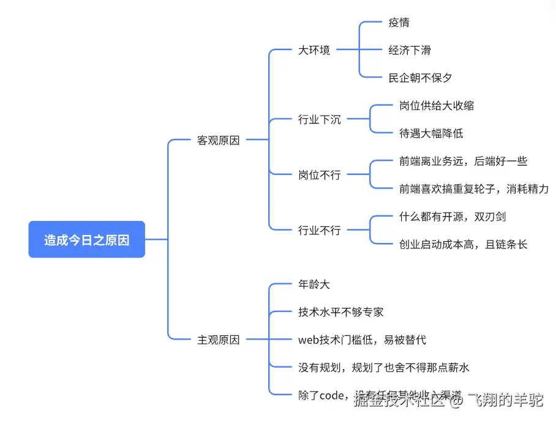

# 8 年老前端开发，成仙路已断

## 前言

到今年，我已经写了 8 年代码。在这段时间里，我的职业生涯一直处于不上不下的状态。尽管在二线城市的薪资看起来还不错，但我早就明白，这行不过是用青春换取血汗钱。从疫情开始，我内心变得愈发焦躁不安，尤其是今年，心态更加低迷。无论是职场上的无尽业务，还是长期的工作倦怠，都在促使我做出改变的决定。

最终，在三月底，我主动离职了（没错，在最艰难的时刻做出了这个决定）。从那时起，这三个多月来，我一直在思考和寻求变化。转眼间，已经到了七月底。虽然这段时间收入不如上班时稳定，但我的状态却越来越好。

## 简单回顾下个人开发经历

本人是双非辣鸡学校毕业。

2016 年 初开始入行前端开发，那时候还处在前后端不分离的时代，开始主要是写 JSP，主要以原生 JS 和 JQ 为主，那时候前端主要是司职辅助功能，事情也比较少，相对比较轻松。

2017 年 开始前后端分离大行其道，也开始用“所谓”的现代化前端框架，那时候主要是用 react 全家桶，当时觉得，卧槽，这 TM 比一个个操作 dom 节点确实方便不少，最关键的是 webpack 之流的工具让前端开发更加成体系，不像以前是寄生在 jsp 里面了，工程化更明显了，当时，前端真正独立成了一个岗位，不再是纯辅助，而是研发流程的重要一环。

2018 年 一整年都在用 RN 开发 APP，第一次接触移动端开发，RN 是我一生的噩梦，以至于后面我看到跨平台的东西做复杂应用就谨慎的很，当时还是 0.5x 的时代，各种安卓、ios 端的 BUG。我记得 RN 官网写的 slogan 一次编写，多端运行，后面可能是投诉太多了，官网后面好像改成还是需要原生安卓/ios 知识了。我记得那时候做一个 IM 应用，长列表白屏，realm 数据库大量消息写入卡顿，各种原生不兼容，我都不记得晚上花了多少时间在 github 的 issue 上找兼容方案和各种 hack 了。再加上当时五大厂商各种魔改安卓，华为刚刚切换鸿蒙系统（就这么巧），无尽的 debuff（现在想想当初直接学原生梭哈更好，泪水不争气的落下）

2019 年 开始用 vue 开发 web，比起 react，更多的语法糖，当时觉得 slot 插槽这种封组件的方法确实要更方便。后面接私单果断 vue 梭哈，做公司产品还是 react，毕竟没有 slot 给队友乱用

2020 年-至今 从疫情开始整个职业规划紊乱。一开始为了更具竞争力，开始往全栈方向发展，努力自学 node.js/koa ，开始用公司的几个小型产品实践，当时一度以为自己全栈，后面才知道我这叫全不占工程师。后面又因为公司业务需求，又开始用 electron 开发桌面应用，用 uniapp 开发多端小程序，用 python 套壳 gpt 的 api（有了后面的经历，我才知道不是巨复杂的应用跨平台的坑也还行），并且机缘巧合之下，还有了机会用 laya 引擎开发微信小游戏。直至最后，彻底成为全不栈工程师，纯纯牛马。

总结职业生涯 没什么规划，跟着公司的业务随波逐流，属于先知后觉，觉醒了又不够决心，总是想着现在行情不好，实在不行再攒一点钱,然后就一直蹉跎到了 2024 年，一事无成。

## 我的反思

既然已经这样了，只能自救了，不然咋办呢哈哈哈哈

### 1、定位问题

- 离开了公司无法生存，没法形成独立生产单元
- 学历、年纪、技术都不占优势
- 行业环境急剧恶化，现在长沙公司基本都是大小周或者单休，属于买方市场，并且加班严重

### 2、分析原因

说白了，核心原因就几个：

- 程序员不能形成独立生产单元，寄生于公司，也没有机会了解整个商品从规划到收款的全生命周期
- 可替代性高，开源生态太强，且总有更厉害的人，总有学历更好的人，怎么卷最终都会失败
- 自身可出售的商品只有时间一项，缺少其他收入

### 3、解决方案

#### 3.1、最优解

- 开发独立产品，这是每一个程序员的梦想，却也是最难得路，属于是下限低，上限高。
- 卖课，也就是所谓的知识付费，现在卖课的平台很多，但是需要人设、背景和标签，还需要运营推广，属于极稳的做法。
- 找个一辈子的养老公司，不是没有，只是不好进，我上次还看见图书馆和纪念馆招人，只是有编制很难。

#### 3.2、临时解

- 接外包,我现在也在接，个中滋味，只能说懂的都懂。
- 找个班上，如果实在缺钱或者不知道做什么，也可以先干着。
- 技术顾问,不同于外包，就是靠着一点经验解决点冷门问题。

#### 3.3、风险解

- 开店，重投入，不成功便成仁，需要梭哈。
- 出海，去日本、东南亚、甚至是更远的地方，写代码也好，干其他的也好，需要勇气。
- 开公司，只要有业务，就能苟活，问题是怎么有业务，需要资源。

### 4、我的解题思路

- 做自己的独立产品，以尝试的心态，，将自己内心的 idea 实现，切勿抱着什么多少爆款的思路，多学习别的独立开发者好的思路和见解。做了就上线，反复试错。
- 关于上班，现在很少有什么新公司，新产品出现，都是旧项目在维护，成仙路已断，注定走不了了。现在基本只接外包单子，上班继续做 web 是不可能了。
- 关于小游戏开发，参照发达国家的经验，可以一直做下去，创意类很难被替代。并且不像 web，这行业的经验不怎么共享，开源代码也少，这是良性生态，由于岗位少，对于职场不友好，但是对于个人开发很不错。做了就上线，反复试错。
- 关于转行，盲目转行不可取，大环境下都是大哥笑二哥。
- 关于技术自媒体，不给自己设限，也可以去做做。

## 我这 3 个月做了什么

今年 4 月迷茫了半个月，然后躺平了半个月，真的好开心。

今年 5 月上半个月学习开传奇私服，然后去自驾去青海湖玩了半个月，真的好开心。

今年 6 月

- 做了一个 AI 做菜小程序，套壳子那种，微信不给上架，说个人不能做信息咨询，放弃。
- 写了一个模拟用户操作爬取数据的桌面工具，后面可能有用。
- 不信邪，做了一个躺平记账的小程序，刚刚上架，是人都要做一次三件套。
- 用 laya 和 cocos 做了几个入门小游戏，并开源，给想 web 转游戏的小伙伴们降低一点曲线，因为游戏引擎的文档不是一般的烂（我原以为小程序的文档很差，直到我看到了几个游戏引擎的文档），大部分时间一边看源码一边开发。

今年 7 月

- 做了 10+传奇私服，并且赚了几百元（聊胜于无），不敢做大，不敢宣传，容易被封印。
- 做了一个创意肉鸽小游戏（有没有美术搭子，全靠 AI 生图走的很艰难），在到处寻找美术资源，代码已写完（等替换完资源就上）。

## 我的规划

2024 年度规划

- 继续做肉鸽、塔防类游戏
- 继续开私服
- 学习新的私服技术（暂定 DNF）
- 继续做自己的独立产品

远景规划

- 追随自己的内心，不给自己设限
- 动态寻找可长期耕耘的赛道

## 写在最后

多年以后，我总是想起 2016 年刚入行时，只用写写 js 就能拿薪水的那个下午。
